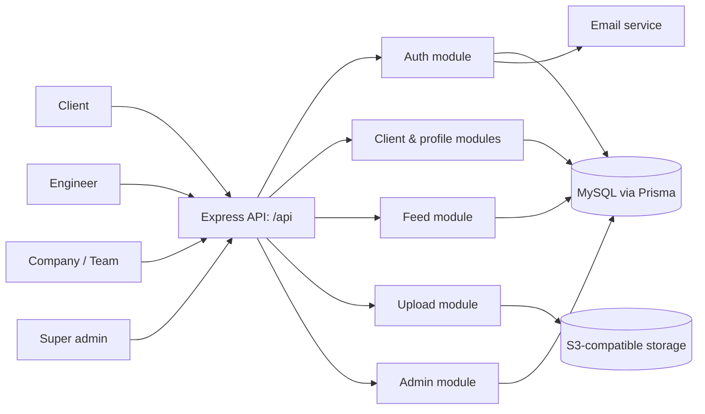
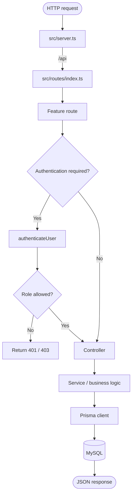
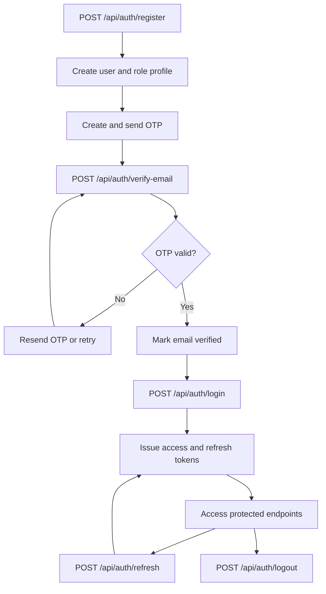
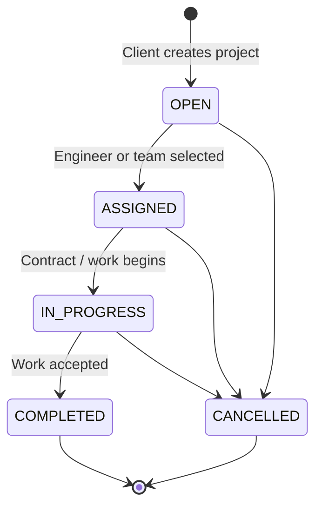
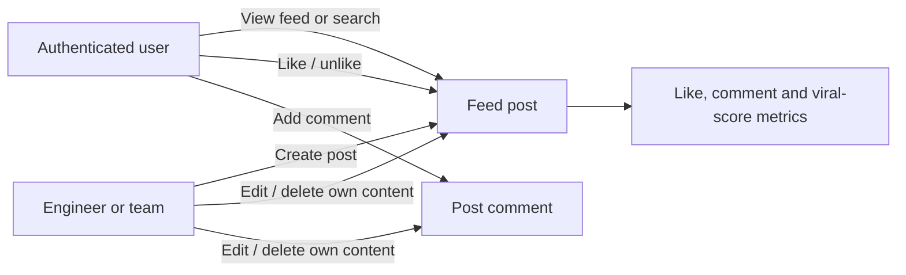
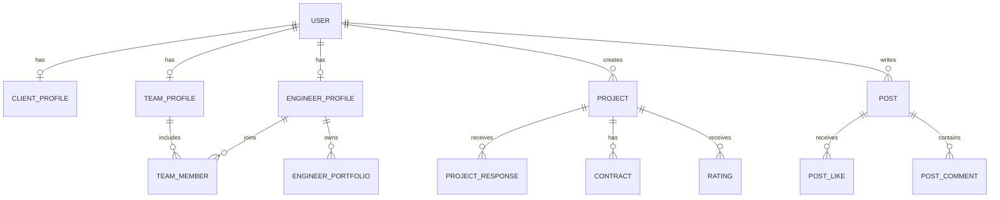

# Enginex project overview

Enginex is an API for an engineering freelancing marketplace. It connects **clients** who need work completed with **engineers** and **companies/teams** that can deliver it.

## User roles

| Role | Main responsibilities |
| --- | --- |
| Client | Maintain a profile, find engineers or teams, save favourites, and create projects. |
| Engineer | Maintain an engineering profile and portfolio, respond to work, and publish feed posts. |
| Company / team | Represent a team, manage its members, respond to work, and publish feed posts. |
| Super admin | Review reports and verification requests. |

## System map

## Request flow

## Core account flow

## Project marketplace lifecycle

## Feed interaction flow

## API modules

| Base path | Purpose | Current route group |
| --- | --- | --- |
| `/api/auth` | Registration, login, OTP verification, token refresh, logout | Auth |
| `/api/clients` | Client profiles, search, favourites and project creation | Client |
| `/api/posts` | Feed, posts, likes and comments | Feed |
| `/api/comments` | Comment editing and deletion | Feed |
| `/api/engineers` | Engineer-only API area | Engineers |
| `/api/team` | Company/team-only API area | Team |
| `/api/admin` | Super-admin-only API area | Admin |
| `/api/uploads` | Authenticated image uploads | Upload |
| `/health` | Service health check | Server |

## Data model at a glance

## Suggested flowcharts to add next

1. Project response flow: engineer/team applies or receives an invitation, client accepts or rejects, and the system creates a contract.
2. Team membership flow: team invites engineer, engineer approves or rejects, membership becomes active.
3. Verification and reporting flow: user submits a request or report, super admin reviews it, and the record is approved, rejected, resolved, or dismissed.
4. Upload flow: authenticated user sends an image, validation checks MIME type and size, then S3 returns a public asset URL.

> Note: The Prisma schema already models projects, responses, contracts, ratings, team members, verifications and reports. Some corresponding route modules are currently placeholders, so their detailed API flows should be defined when those endpoints are implemented.
